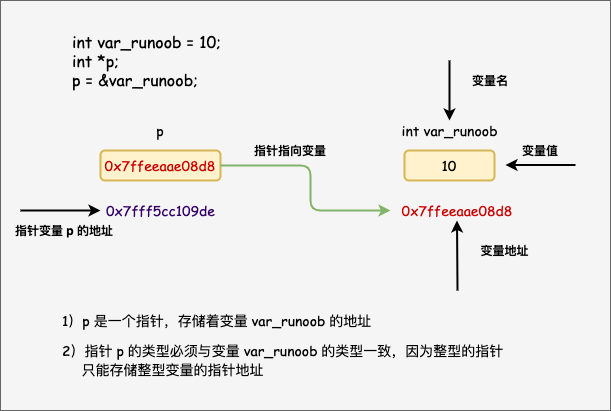

##  指针

> 指针也就是内存地址，指针变量是用来存放内存地址的变量；



```c
//指针的使用
{
   int  var = 20;   /* 实际变量的声明 */
   int  *ip;        /* 指针变量的声明 */
   ip = &var;  /* 在指针变量中存储 var 的地址 */
   printf("var 变量的地址: %p\n", &var  );
   printf("ip 变量存储的地址: %p\n", ip );
   /* 使用指针访问值 */
   printf("*ip 变量的值: %d\n", *ip );
}

//如果没有确切的地址可以赋值，为指针变量赋一个 NULL 值
int  *ptr = NULL;
```


### 详解

#### 指针的算术运算

- 递增/递减指针：指针地址变化量取决于元素类型大小
- 指针的比较：比较的是地址大小（判断某元素与另外元素的相对位置）

#### 指针数组

> [!NOTE]
>
> 表示数组中的元素为指针

```c
{
    int arr={1,2,3};
    int *pta[3];
    for(i=0;i<3;i++,pta++){
        pta=&arr[i];
    }
    
    //访问指针数组
     for ( i = 0; i < MAX; i++){
        printf("Value of %d\n", i, *pta[i] );//或者写成*(pta++)
    }
}
```


#### 指向指针的指针

> 即A指针存放的是B指针的地址，B指针存放的是目标元素的地址

```c
{
    int a=10;
    int *p1,**p2;
    p1=&a;
    *p2=&p1;
    printf("%d",**p2);
}
```


#### 传递指针给函数

> 此时改变指针指向的内容，实参也会随之改变；参考[函数章节](./2.函数.md#section2)中的引用传递


#### 从函数返回指针

> 参考[数组章节](./3.数组.md#ArrToFunc)中函数返回数组


#### 函数指针

> 指向函数的指针

```c
int func(int a,int b){
    printf("%d",a+b);
}
int main(){
    int (*p)(int,int)=&func;//&可省略
    sum=p(1,2);
}
```


#### 回调函数

> 将一个函数当作另外一个函数的参数，回调函数就是一个通过函数指针调用的函数

```c
#include <stdlib.h>  
#include <stdio.h>
 
void populate_array(int *array, size_t arraySize, int (*getNextValue)(void))
{
    for (size_t i=0; i<arraySize; i++)
        array[i] = getNextValue();
}
 
// 获取随机值
int getNextRandomValue(void)
{
    return rand();
}
 
int main(void)
{
    int myarray[10];
    /* getNextRandomValue 不能加括号，否则无法编译，因为加上括号之后相当于传入此参数时传入了 int , 而不是函数指针*/
    populate_array(myarray, 10, getNextRandomValue);
    for(int i = 0; i < 10; i++) {
        printf("%d ", myarray[i]);
    }
    printf("\n");
    return 0;
}
```

