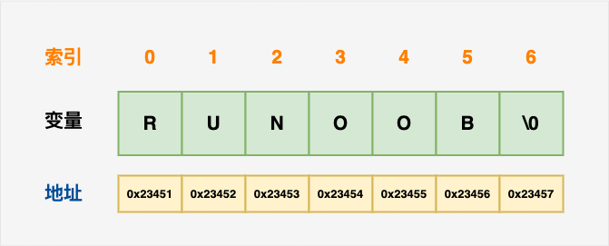

## 字符串

>  C 语言中，字符串实际上是使用空字符 **\0** 结尾的一维字符数组。

```c
char arr[7]={'R','U','N','O','O','B','\0'};
char arr[]="RUNOOB";//等同上述数组
```



操作字符串的函数：

| 序号 | 函数 & 目的                                                  |
| :--: | ------------------------------------------------------------ |
|  1   | **strcpy(s1, s2);** 复制字符串 s2 到字符串 s1。              |
|  2   | **strcat(s1, s2);** 连接字符串 s2 到字符串 s1 的末尾。       |
|  3   | **strlen(s1);** 返回字符串 s1 的长度。                       |
|  4   | **strcmp(s1, s2);** 如果 s1 和 s2 是相同的，则返回 0；如果 s1<s2 则返回小于 0；如果 s1>s2 则返回大于 0。 |
|  5   | **strchr(s1, ch);** 返回一个指针，指向字符串 s1 中字符 ch 的第一次出现的位置。 |
|  6   | **strstr(s1, s2);** 返回一个指针，指向字符串 s1 中字符串 s2 的第一次出现的位置。 |

### 字符串中的sizeof和strlen区别

sizeof会包含字符串后自动加入的`\0`；strlen只是计算字串的长度

### 注意

> [!CAUTION]
>
> 使用指针直接指向字符串常量时，是不能通过指针修改内容的；需使用`strcpy()`将字符串拷贝到指针的内存空间


